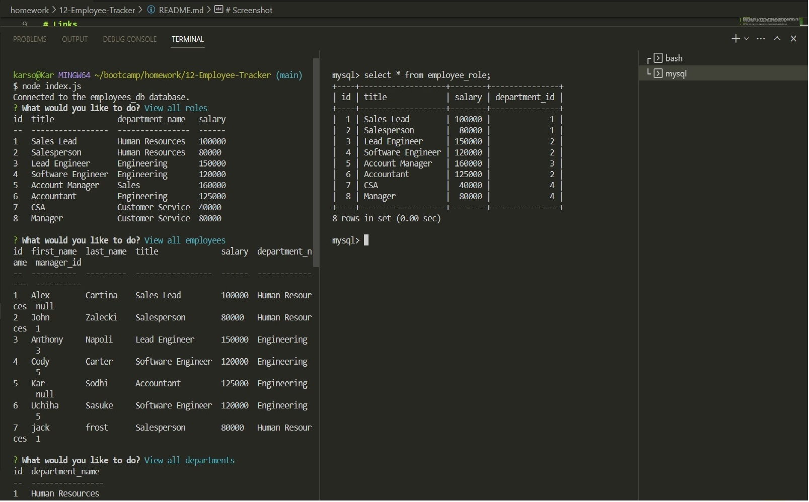

# Employee-Tracker

# Description
This is an app that will allow you to add departments, roles, and team members into a company.  Roles can also be updated for an employee

# Installation
Run npm install to install all of the packages.  Then log into mysql with the terminal by using mysql -u root -p then run source db/schema.sql and source db/seeds.sql to begin the table framework with the information from seeds. Run node index.js in the regular terminal to start the file and begin prompts.  Answer the prompts or select what is needed to view the data. 

# Links
Live video link: https://drive.google.com/file/d/1HCmgJP1B1haSoYeg0D_Mp7eXNt2PdJ8o/view

Github Repo: https://github.com/karsodhi/12-Employee-Tracker

# Mentions
Had help from the tutoring service supplied by Northwestern Coding Camp

# Screenshot

